# Choose Your Own Adventure!

```mermaid

flowchart TD

  A[Ready to start your adventure?] --> B[Yeah, I'm hyped!]
  A --> C[No😠]
  C --> A

  B --> |You awaken in a dark, damp room. The dank floor makes you shiver in disgust. Your cellmate is dead, but a rotting pile of bones. However, something shimmers in his chest.|D[Grab the object?]
  D --> E[Yeah!]
  D --> F[Looks dangerous, NO!]

  E--> G[You died! The shining object turned out the be an incredibly infectious magic crystal]
  G --> A
  F --> H[You find a key and leave the dank cell.]
  H --> |As you wander the halls of the forgotten prison, a decripit skeleton crosses your path. Its hollow eyes display a malice you can't shake off.|I[Fight it?]

  I --> J[ I got that, light work!]
  I --> K[ Oh nah, I'm heading for the hills!]

  J --> L[ Because of how old and rotten the skeleton is, he crumbles to dust in one blow. Among his possesions, you find the guard keys to leave the prison.]
  K --> M[ Rookie mistake! You turn your back on the skeleton and he has no hesitation in going for a back stab.]
  M --> A

  L --> | After a long journey, you find your way to The Outside. You open the doors, only the find the world a crude wasteland of what it once was. With not a human in sight, despair overwhelsm you. Good luck, Wanderer. | N[The End]

```

## Entity Descriptions and Relations
* **_Box A_**: Serves the purpose of starting our adventure. Linked **B** and **C** as options choosing to start the game, or not.
* **_Box B_**: Choosing to really begin. Links to **Cell Description** and **D** to start the storytelling and adventure.
* **_Box C_**: An option just there as a gag, but if someone really doesn't want to begin, it's there. Links back to **A**, forcing the user in a loop until they play.
* **_Cell Description_**: Describes the cell, and provides context for the upcoming boxes. Links to **D**, as it provides context for this scenario.
* **_Box D_**: Asks the question, based on previous context given by cell description. Links to **E** and **F**, as they are possible options for the scenario described in **D**
* **_Box E_**: The first decision you can make about the object. This option links back to **G**, which describes the effects.
* **_Box F_**: The second decision you can make about the object. This options will lead you to **H**, which tells the outcome.
* **_Box G_**: Informs you of the actions of your consequences, takes you back to the start. Links back to **A** since your character met misfortune on the adventure.
* **_Box H_**: Allows you to continue your journey. Links to the **Hall Description + Skeleton**, since that is the next location on the character's journey.
* **_Hall Description + Skeleton_**: Creates the context for the combat question. Connects to **I**, since the question there is based on the context of this entity.
* **_Box I_**: Asks the question, based on context of the halls and skeleton. Connects to **J** and **K**. since they are options regarding combat based on this description.
* **_Box J_**: First decision regarding combat. Links to **L**, which explains the results of the fight.
* **_Box K_**: The second decision regarding combat. Links to **M**, shows the consequences of your cowardice.
* **_Box L_**: The choice that results in victory, continues plot. Links to the **Ending Text**, signifying the end of your adventure.
* **_Box M_**: Results in loss, the choice sends you back to the start. Links to **A**, allowing the player to start again.
* **_Ending Text_**: Desciption of the world after you escape prison. The future is left to player imagination. Links to **N** to formally wrap up the story.
* **_Box N_**: Wraps up the story. Doesn't lead anywhere, it's the end.

## How do These Make Sense in Context?
> In the context of a CYOA story, these relationships make sense, as it grants the player the option to travel down different paths, but ultimately there is one objectively better path that can be followed, like in most stories. The way the relationships are set up for questions allow for the making of unique decisions, and the context bubbles allow the player to make a decision based on more than just their basic wits.
